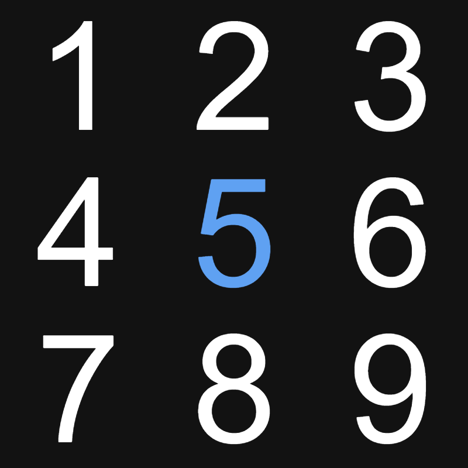

# [Sudoku](https://lengler.dev/sudoku/)

Touch optimized sudoku built with Rust/WASM/TypeScript/React.

## Packages
### [sudoku-rs](sudoku-rs)
The core Rust sudoku library. Contains sudoku grid/cell logic, grid parsers, solvers and a generator.

The size of the sudoku is defined by the generic parameter [SudokuBase](sudoku-rs/src/base.rs),
which defines the side length of each block.

### [sudoku-wasm](sudoku-wasm)
[wasm-bindgen](https://github.com/rustwasm/wasm-bindgen) wrapper around `sudoku-rs`.

### [sudoku-web](sudoku-web)
React application written in TypeScript. Uses `sudoku-wasm` inside a web worker for all game logic.
Features touch support, highlighting, two edit modes (normal/"sticky"), sudoku import/generation.
The PWA integration enables offline usage.

### [sudoku-afl](sudoku-afl)
[AFL Fuzzer](https://github.com/google/AFL) harness for grid parsers.

### [sudoku-rs/fuzz](sudoku-rs/fuzz)
[cargo fuzz](https://github.com/rust-fuzz/cargo-fuzz) harness for grid parsers.

### [sudoku-api](sudoku-api)
WIP [Rocket](https://rocket.rs/) API server to support `sudoku-web`.